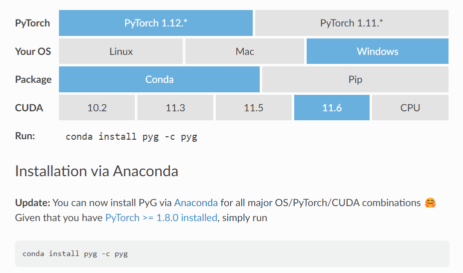
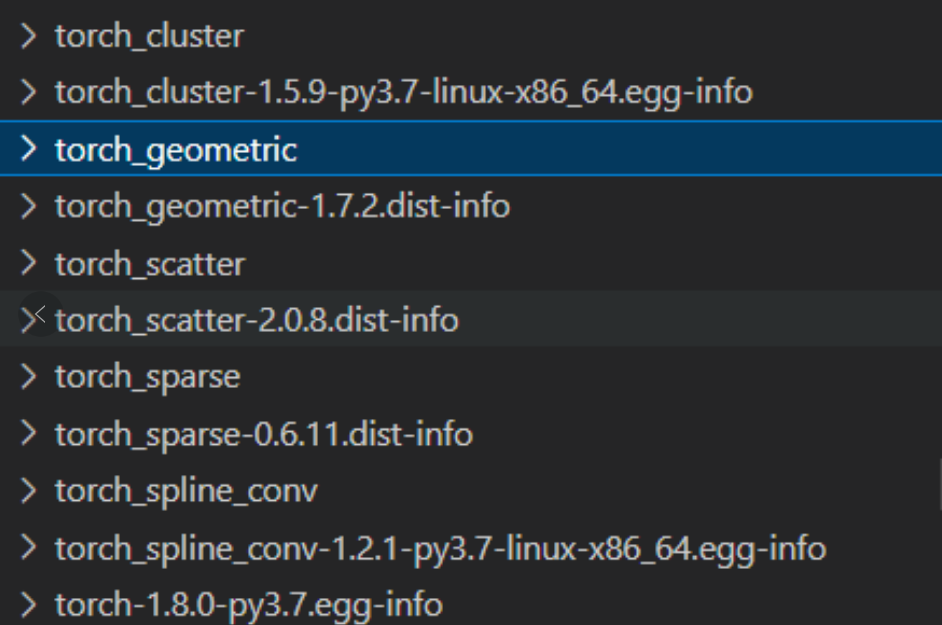
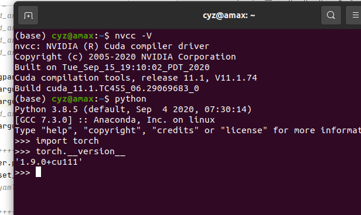

# Anaconda使用笔记

## 环境管理命令

创建新环境

envname 是新建的环境的名字

注意需要加上最后的python以及指定版本，会初始化很多安装其他内容必要的东西。

```shell
conda create --name envname 
# eg.
conda create --name python36 python=3.6
conda create -n envname python=3.4 scipy=0.15.0 astroib numpy

# 带着 python 创建，其他的 pip 等也会提示安装。
```

显示已经创建的环境

``` shell
conda info -e
```

删除虚拟环境

```shell 
conda remove -n envname --all
```

激活一个环境

``` shell
conda activate python36
```

查看这个环境的包

```shell
# conda list --explicit
pip list
```

显示所有环境及存放位置

```shell
conda env list
```

在当前环境安装包

```shell
conda install scrapy
pip install jupyter

# 速度一般会很慢，所以用以下命令，‘-i’指定下载的路径
# 后面说过了，罪域
pip install jupyter -i https://pypi.tuna.tsinghua.edu.cn/simple/

#一些地址
阿里云 http://mirrors.aliyun.com/pypi/simple/
中国科技大学 https://pypi.mirrors.ustc.edu.cn/simple/ 
豆瓣(douban) http://pypi.douban.com/simple/ 
清华大学 https://pypi.tuna.tsinghua.edu.cn/simple/
中国科学技术大学 http://pypi.mirrors.ustc.edu.cn/simple/
华中理工大学：http://pypi.hustunique.com/
山东理工大学：http://pypi.sdutlinux.org/ 
```

清除多余的包

``` shell
conda clean -a
```

执行 Python

``` shell
python # 进入命令行编写 Python
python ADC.py # 执行编写好的 .py 文件
```

## 实验环境配置

### torch-geometric

torch-geometric 对环境要求比较苛刻，新的环境都不能用



这是官网的要求，可以看到，要求Pytorch的环境在 1.8 到 1.12之间，而且CUDA的环境也只有四个选项。

除此以外，torch-geometric有四个常一起使用的包

- torch-cluster

- torch-scatter
- torch-sparse
- torch-spline-conv

这四个包以及torch-geometric耦合的都比较多，都不太好安装。

最新的找到的方式是，在[anaconda官网](https://anaconda.org/)直接搜索需要的包，然后运行命令安装。可以看到pyg下载的最多，他也维护了全部四个需要的组件。

	

## conda install 源配置

### 为本地conda环境配置国内镜像源

（后面说过了，不太建议配置这个）

中科大镜像源

```shell
conda config --add channels https://mirrors.ustc.edu.cn/anaconda/pkgs/main/
conda config --add channels https://mirrors.ustc.edu.cn/anaconda/pkgs/free/
conda config --add channels https://mirrors.ustc.edu.cn/anaconda/cloud/conda-forge/
conda config --add channels https://mirrors.ustc.edu.cn/anaconda/cloud/msys2/
conda config --add channels https://mirrors.ustc.edu.cn/anaconda/cloud/bioconda/
conda config --add channels https://mirrors.ustc.edu.cn/anaconda/cloud/menpo/
conda config --add channels https://mirrors.ustc.edu.cn/anaconda/cloud/
```

阿里镜像源

```shell
conda config --add channels https://mirrors.aliyun.com/pypi/simple/
```

豆瓣的python的源

```shell
conda config --add channels http://pypi.douban.com/simple/ 
```

### 显示检索路径，每次安装包时会将包源路径显示出来

```shell
conda config --set show_channel_urls yes
conda config --set always_yes True
```

### 显示所有镜像通道路径命令

```shell
conda config --show channels
```

### 显示添加的源通道

```shell
conda config --show-sources
```

### 移除某一镜像源

```shell
conda config --remove channels 源名称或链接 
```

### 注意

这是 pytorch 官网推荐的命令，最后的 -c 是指定源，需要删掉。

```shell
conda install pytorch torchvision torchaudio pytorch-cuda=11.6 -c pytorch -c nvidia
```

## Conda 环境导出与导入

这个试了试，并不是很好用。

#### Step 1 查看环境

 win + R -> cmd 输入

```cpp
conda env list
```

#### Step 2 进入要导出的环境

 ''mypytorchGPU''为我的环境名

```undefined
activate mypytorchGPU
```

#### Step 3 导出环境信息为yml文件

 ''C:\Users\MSI-NB\Desktop''为我的桌面路径, ''torchGPUcopy''为自定义名字

```bash
conda env export --file C:\Users\MSI-NB\Desktop\ torchGPUcopy.yml
```

#### Step 4 导入另外一个电脑

 ''C:\Users\student\Desktop''为另外一个电脑的桌面路径，还是win+R->cmd

```shell
conda env create -f C:\Users\student\Desktop\torchGPUcopy.yml
# 那个 -f 是 file 的意思
```

## pip 环境导出与导入

### 激活相应虚拟环境

```shell
conda env list   #　查看所有的conda虚拟环境
source activate env_name
```

#### 生成requirements.txt文件

```shell
pip freeze > requirements.txt # 会生成到 “user/当前用户” 文件夹下
```

#### 安装requirements.txt依赖

```shell
conda create -n env_name python=3.6   # 创建新的虚拟环境
source activate env_name      # 激活新建的虚拟环境
pip install -r requirements.txt
```


## 环境配置经验

多次环境配置之后总结的经验

1. 不要一味相信“使用一个命令安装全部组件”，尤其是 pyg，使用一个命令安装完全不可行，pyg 的安装建议使用 pip 命令安装本地已经下载好的或者网络上的包。
2. PyTroch 等的安装相对于使用 pip 命令更建议使用 conda 命令，因为 conda 会保证包之间是相互协调的，而 pip 没有这个功能。使用 conda 安装可能网络问题会有影响，可以多等待一会，不建议配置源，配置之后可能会因为对应 cuda 版本的 PyTroch 包下载不到，转而下载 CPU版本的 PyTorch，导致最后 cuda并不能 available。


GSC 需要的环境：

我的pytorch 是1.8.0

torch_geometric我用的是1.7.2



122服务器基本环境：

pyg的组件都是一样的



pyg组件下载：

[data.pyg.org/whl/](https://data.pyg.org/whl/)

知乎教程：[PyTorch Geometric(PyG) 库的安装 - 知乎 (zhihu.com)](https://zhuanlan.zhihu.com/p/602615941)

最后运行：pip install torch-geometric==1.7.2

pytorch 之前版本：

[Previous PyTorch Versions | PyTorch](https://pytorch.org/get-started/previous-versions/)

cudatoolkit可以直接在conda里面下载，torch的安装命令里面有指定cuda的版本

>  CUDA toolkit 不用专门下载（就是说在英伟达官网下载），直接在anaconda环境中install一个合适版本的 cuda toolkit 就行。但是驱动还是需要正常安装的。


3090 的卡不支持 cuda-toolkit 10.2，至少 11.1

